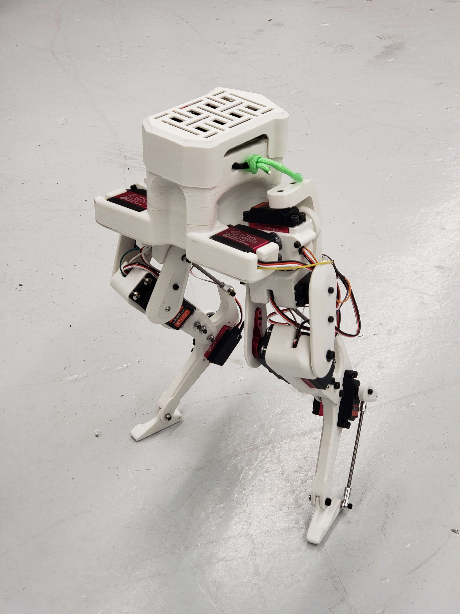
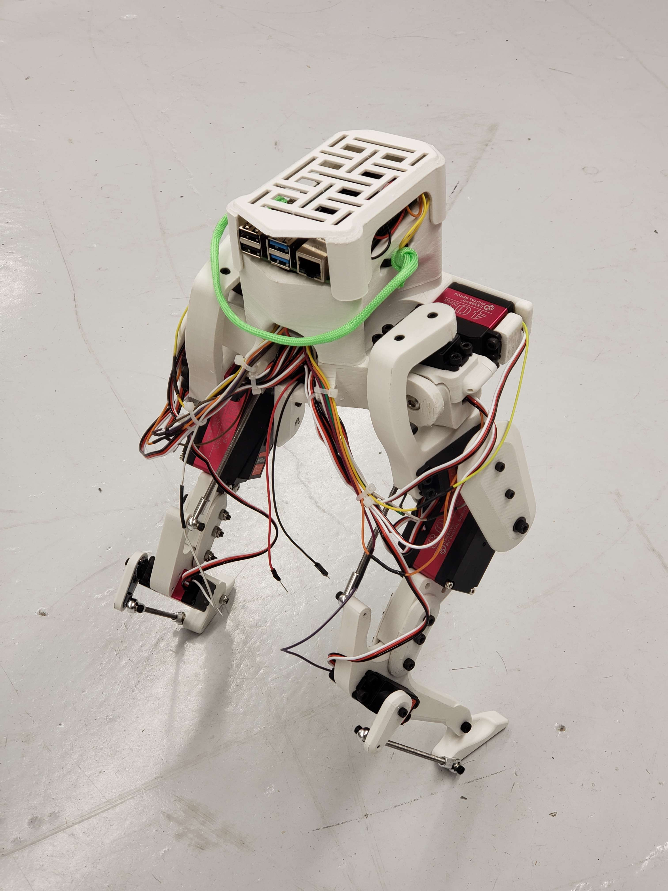

# Legolas - An Open Source Bipedal Robot

Legolas is a mini bipedal robot inspired by the Cassie by Agility Robotics. The project aims to provide an open-source platform for learning and applying reinforcement learning in robotics.

<p align="center">
  
  
</p>

## Repository Contents

This repository contains CAD files and 3D printing files for Legolas. The code for the robot is available in a [separate repository](https://github.com/daviddoo02/Legolas_Controller).

## Getting Started

1. **Clone this repository:**

    ```bash
    git clone https://github.com/daviddoo02/Legolas-an-open-source-biped/
    ```

2. **Modify the CAD files:**

    Modify the CAD files to fit your specific needs using Solidworks.

3. **3D Print your own robot:**

    Alternatively, use the provided STL files located in `CAD/Legolas/V2/STLs` to 3D print your own robot.

4. Assemble the robot and have fun!

## Required Materials

Materials and components used are listed and linked below.

### Main Body

1. [3D printing filament x 1 kg](https://www.amazon.com/dp/B089S1HB8K)
2. [Metric Nuts and Bolts](https://www.amazon.com/Assortment-M2-M3-M4-M5/dp/B0CBMMPPKF)
3. [Metric Locknuts](https://www.amazon.com/dp/B0CHVTYLWC)
4. [Thrust Bearings](https://www.amazon.com/gp/product/B08FHTD8VT)
5. [Ball joint rod end](https://www.amazon.com/gp/product/B0828T1NNW)
6. [M4 threaded rod](https://www.amazon.com/gp/product/B01MAYQ12S)

### Electronics

1. [Raspberry Pi 4](https://www.amazon.com/Raspberry-Model-2019-Quad-Bluetooth/dp/B07TC2BK1X)
2. [PCA9685 Servo Driver Board](https://www.amazon.com/gp/product/B07BRS249H)
3. [40 kg Hobby Servos x 8](https://www.amazon.com/Servo-Torque-Waterproof-Degree-Compatible/dp/B0C95YMMQS)
4. [80 kg Hobby Servos x 2](https://www.amazon.com/GoolRC-Digital-Torque-Waterproof-Replacements/dp/B0B5H4MWZG/ref=sr_1_2?crid=1JM9GBMY97KTM&keywords=80%2Bkg%2Bservo&qid=1705472455&sprefix=80%2Bkg%2Bservo%2Caps%2C98&sr=8-2&th=1)
5. [MPU6050 IMU](https://www.amazon.com/Acceleration-Sensors-Accelerometer-Three-Axis-Quadcopter/dp/B07V67DQ5N)
6. [ADS1115 ADC](https://www.amazon.com/gp/product/B07VPFLSMX)
7. [Jumper Wires](https://www.amazon.com/Elegoo-EL-CP-004-Multicolored-Breadboard-arduino/dp/B01EV70C78)
8. [Power DIY Connector](https://www.amazon.com/dp/B09S3S6RYC)
9. [USB C Connector](https://www.amazon.com/dp/B0CCJRWKC5)
10. [4 to 1 Wire Connector](https://www.amazon.com/dp/B0B28GNVGZ)

## Assembly Instruction

Instructions and examples for assembling Legolas will be added in future updates.

## License

This project is licensed under the MIT License - see the [LICENSE](LICENSE) file for details.

## Acknowledgments

- Inspired by the Cassie robot by Agility Robotics.
- Solidworks was used for the physical design of the robot.
